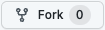

# CSS Selectors
This activity was created to practice how to use the different types of CSS selectors.

You can do this activity in your own machine choosing one of the steps bellow:
- Clone the repo into your machine typing in the terminal/ubuntu/git bash:
 `git clone https://github.com/FEWD-E-04/css-selectors.git`
- Fork the repo to your personal GitHub account and then clone it to your machine:
    1. Click the fork button at the top right corner of this page 
    2. Then clone it to your machine using your repo HTTPS or SSH credentials:`git clone https://github.com/your-repo-address`

To see how the selectors work go to the css file **(styles.css)** and uncomment the CSS declaration block to see the result in the browser.

What tools you need:
 - An IDE (VS Code, Atom, Brackets, Sublime, ...)
 - Git - https://git-scm.com/downloads
 - A CLI (Command Line Interface) running Bash (Terminal [MACOS], Ubuntu [Linux], GitBash [Windows])
 - Live Server extension installed in the IDE
 - Any browser (Google Chrome, Safari, Edge, Safari, ...)

 Languages used:
 - HTML
 - CSS
